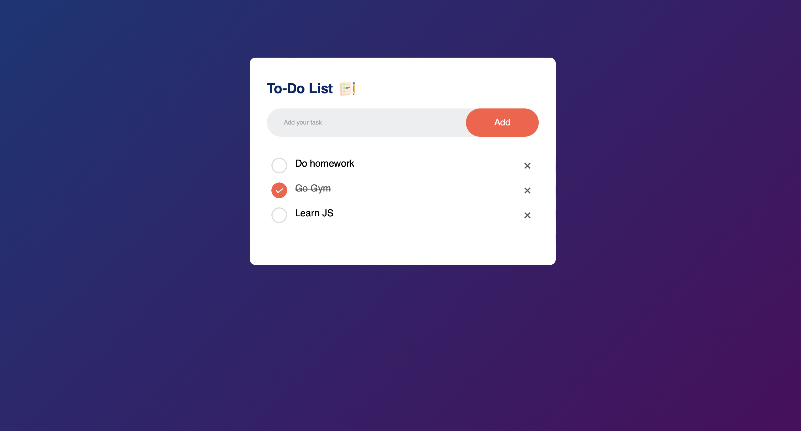

# Todo Website Documentation

This documentation provides an overview of a Todo website built using HTML, CSS, and JavaScript. The website allows users to input tasks, mark them as complete, and clear completed tasks.


## Table of Contents

1. [Getting Started](#getting-started)
   - [Prerequisites](#prerequisites)
   - [Installation](#installation)
2. [Features](#features)
   - [Creating a Task](#creating-a-task)
   - [Marking a Task as Complete](#marking-a-task-as-complete)
   - [Clearing Completed Tasks](#clearing-completed-tasks)
3. [File Structure](#file-structure)
4. [Contributing](#contributing)
5. [License](#license)

## Getting Started

### Prerequisites

To run the Todo website, you need a web browser installed on your system (e.g., Google Chrome, Mozilla Firefox).

### Installation

To use the website, follow these steps:

1. Clone the repository:

   ```bash
   git clone https://github.com/your-username/todo-website.git
   ```

2. Navigate to the project directory:

   ```bash
   cd todo-website
   ```

3. Open the `index.html` file in your preferred web browser.

## Features

The Todo website provides the following features:

### Creating a Task

Users can create a new task by following these steps:

1. Enter the task details in the input field provided.
2. Press the "Enter" key or click the "Add" button to add the task to the list.

### Marking a Task as Complete

To mark a task as complete, users can:

- Click the checkbox next to the task. The task will be visually marked as complete.

### Clearing Completed Tasks

Users can clear completed tasks from the list by following these steps:

1. Click the "Clear Completed" button.
2. The task will be removed from the list.

## File Structure

The file structure of the Todo website is as follows:

```
todo-website/
├── index.html
├── styles.css
├── script.js
└── README.md
```

- `index.html`: The HTML file containing the structure of the Todo website.
- `styles.css`: The CSS file containing the styles and layout of the website.
- `script.js`: The JavaScript file containing the logic and functionality of the website.
- `README.md`: The documentation file providing information about the website.

## Contributing

Contributions to the Todo website are welcome! If you find any issues or have suggestions for improvements, please feel free to submit a pull request or open an issue in the [issue tracker](https://github.com/your-username/todo-website/issues).

When contributing to this project, please follow the [code of conduct](CODE_OF_CONDUCT.md).
